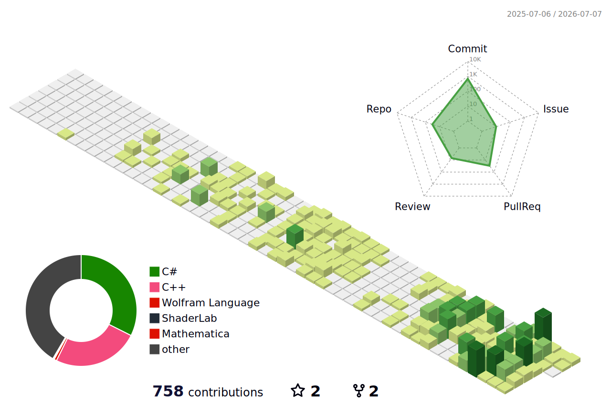

# DevCol - Development Collaboration

 

<!--

👨🏻‍💻 in9: [In Goo Lee Github](https://github.com/i9lee218).

**devcol-main/devcol-main** is a ✨ _special_ ✨ repository because its `README.md` (this file) appears on your GitHub profile.

Here are some ideas to get you started:
🔹🔷🧑🏻‍💻👨🏻‍💻

- 🔭 I’m currently working on ...
- 🌱 I’m currently learning ...
- 👯 I’m looking to collaborate on ...
- 🤔 I’m looking for help with ...
- 💬 Ask me about ...
- 📫 How to reach me: ...
- 😄 Pronouns: ...
- ⚡ Fun fact: ...
-->
