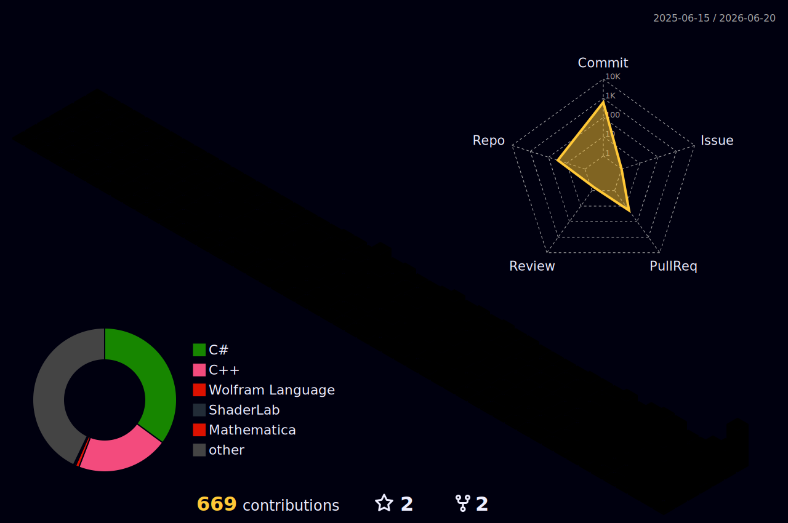

<h1>
  <div align="center">    
  
  <br/> 
    <br/>
  DevCol (Development Collaboration) 
  <br/>
    <br/>
  </div>
</h1>


<details>
<summary><h2><b>&nbsp;Table Of Contents</b></h2>&nbsp;</summary>

- [Social Links](#social-links)
- [GitHub Stats](#github-stats)
- [Game](#game)
- [Project](#project)

<!--
- <a href="#project"> Project </a>
  - <a href="#game">  Game </a>
--->
---
</details>


## Social Links
[](https://github.com/devcol-main)  &nbsp; [](https://www.youtube.com/@devcol) &nbsp; [-DevCol-style?style=for-the-badge&logo=tistory&logoColor=white&labelColor=FFE300&color=black)](https://devcol.tistory.com/) &nbsp; [-DevCol-style?style=for-the-badge&logo=blogger&logoColor=white&labelColor=FF5722&color=black)](https://dev-col.blogspot.com/) &nbsp; [](https://www.linkedin.com/in/ingoolee/) &nbsp; [](mailto:iglee219@gmail.com)  &nbsp;
<br/>

<a name="github-stats"></a>
##  GitHub Stats

<table><tr><td valign="top" width="50%">

<!--
// with hide

-->


</td><td valign="top" width="50%">





</td></tr></table>


<!--

-->


<!--
<details>
<summary>Click to toggle contents of `code`</summary>

```
CODE!
```
</details>
  -->

<!-- GAME  -->

<h2>
	
		&nbsp; <a name="game">Game</a> &nbsp; 
	
</h2>

<b>&nbsp;Unreal Engine (Study Projects)</b>

<a href="https://github.com/devcol-main/FirstUE5FPS" target="_blank">
 
</a>


---
<br/>

<!-- PROJECT  -->

<h2>
	
	&nbsp; <a name="project">Project</a> &nbsp; 
	
</h2>


<!--
===== End Line =====
  -->

 <div align="center">    
	 

</div>
<!--

  -->
  
 <div align="center">  


</div>

---

<div align="right">  
 
DevCol

</div>


<!-- 
 

&nbsp;
theme dif
<a href="https://github.com/devcol-main/FirstTimeUsingCppinUE5" target="_blank">
 
</a>

<a href="https://github.com/devcol-main/FirstTimeUsingCppinUE5" target="_blank">
 
</a>

<a href="https://github.com/devcol-main/FirstTimeUsingCppinUE5" target="_blank">
 
</a>

<a href="https://github.com/devcol-main/FirstTimeUsingCppinUE5" target="_blank">
 
</a>

<a href="https://github.com/devcol-main/FirstTimeUsingCppinUE5" target="_blank">
 
</a>

<a href="https://github.com/devcol-main/FirstTimeUsingCppinUE5" target="_blank">
 
</a>

<a href="https://github.com/devcol-main/FirstTimeUsingCppinUE5" target="_blank">
 
</a>

<a href="https://github.com/devcol-main/FirstTimeUsingCppinUE5" target="_blank">
 
</a>

<a href="https://github.com/devcol-main/FirstTimeUsingCppinUE5" target="_blank">
 
</a>

<a href="https://github.com/devcol-main/FirstTimeUsingCppinUE5" target="_blank">
 
</a>

-->


<!--


ref: https://docs.github.com/en/get-started/writing-on-github/getting-started-with-writing-and-formatting-on-github/basic-writing-and-formatting-syntax

> [!NOTE]
> Useful information that users should know, even when skimming content.

> [!TIP]
> Helpful advice for doing things better or more easily.

> [!IMPORTANT]
> Key information users need to know to achieve their goal.

> [!WARNING]
> Urgent info that needs immediate user attention to avoid problems.

> [!CAUTION]
> Advises about risks or negative outcomes of certain actions.
-->

<!--

👨🏻‍💻 in9: [In Goo Lee Github](https://github.com/i9lee218).

**devcol-main/devcol-main** is a ✨ _special_ ✨ repository because its `README.md` (this file) appears on your GitHub profile.

Here are some ideas to get you started:
🔹🔷🧑🏻‍💻👨🏻‍💻

- 🔭 I’m currently working on ...
- 🌱 I’m currently learning ...
- 👯 I’m looking to collaborate on ...
- 🤔 I’m looking for help with ...
- 💬 Ask me about ...
- 📫 How to reach me: ...
- 😄 Pronouns: ...
- ⚡ Fun fact: ...
-->
